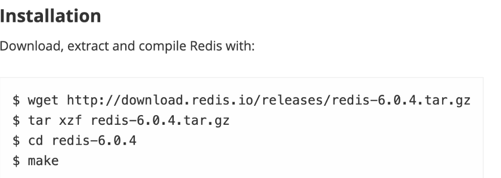
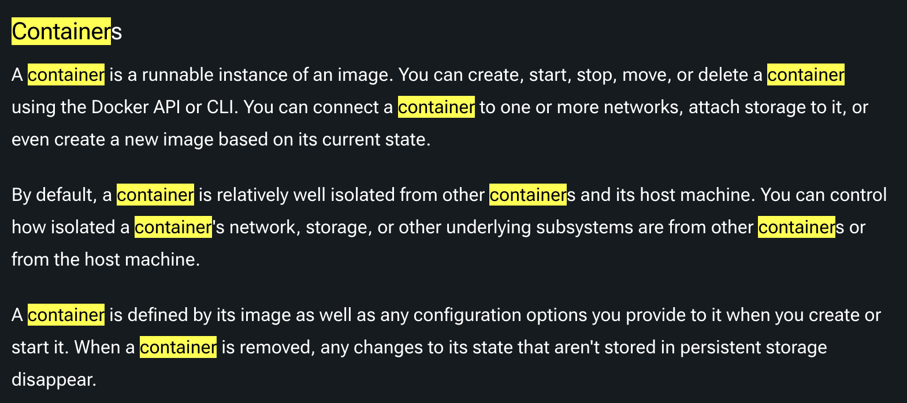

# 따라배우는 Docker

우선 사내에서 Docker를 사용하고 있는데 왜 사용하는지 모름. 귀여운 고래다. 끝

> ~~(필자는 귀여운게 싫다, 귀여운 것들은 이유가 있고 까볼수록 해악스럽기에)~~

그러던 와중 올리브영에서 진행된 [AWSKRUG의 Next.js와 AWS ECS, CI/CD](https://docs.google.com/presentation/d/1-7N_Ryb2HvQuz9VUT1OYOVouOEYzuuhgAR8zZR1bgSs/edit?usp=sharing) 행사에 다녀왔고, Git Action와 CDN까지 흐름을 살펴보는 시간을 가졌습니다

첫주에는 Docker가 뭐고, 왜 사용해야 하며, 기본적인 개념에는 어떤 것이 있는지 살펴보겠습니다.

 

## Docker를 왜 써?

간단하게 이해를 하면, 어떠한 프로그램을 다운로드하는 과정을 간단하게 만들기 위해서 사용한다.

Docker를 사용하지 않고 프로그램을 설치할 때는 **Installer 설치 => Installer 실행 => 프로그램 설치 완료** 순서로 진행되지만, 서버, 패키지 버전, 운영체제 등등 여러 가지 에러를 핸들링하게 되고, 설치 과정이 복잡하다.

하지만 Docker를 사용하면 과정이 간단해진다!

ex) 우리는 Redis를 설치할 때 아래의 명령어를 실행한다. 하지만 곧 오류를 마주하게 된다. Why?? wget이 없기때문에..

하지만 킹왕짱 Docker를 사용하면? **docker run -it redis** 를 하면 다운이 끝난다 ㅋㅋ

 

그래서 Docker를 사용하는 이유를 정리하면 아래와 같다.

- **환경 일관성 유지** : Docker를 사용하면 개발 환경, 테스트 환경, 프로덕션 환경 간의 일관성을 유지할 수 있어, 로컬에서 테스트한 코드가 실제 배포 환경에서도 동일하게 동작함을 보장할 수 있다.

- **의존성 관리** : Docker 컨테이너는 애플리케이션이 필요한 모든 라이브러리와 종속성을 포함하므로, 다른 환경에서 발생할 수 있는 의존성 충돌 문제를 해결할 수 있다.

- **이식성** : Docker 컨테이너는 특정 운영체제나 클라우드 서비스에 종속되지 않아서 어디서나 실행될 수 있고, 애플리케이션을 배포할 수 있다.

- **확장성** : 컨테이너 기반 애플리케이션은 쉽게 확장할 수 있다. 여러 컨테이너를 실행하여 부하를 분산시키고, 필요에 따라 자원을 할당할 수 있다.

- **버전 관리** : Docker 이미지는 버전 관리가 가능하여, 특정 버전의 이미지를 쉽게 롤백하거나 배포할 수 있다.

- **CI/CD 통합**: Docker는 CI/CD(지속적 통합/지속적 배포) 파이프라인과 통합되어, 코드 변경 사항을 자동으로 테스트하고 배포할 수 있다.

 

## 그래서 Docker가 머야?

Docker은 컨테이너를 사용하여 응용프로그램을 더 쉽게 만들고 배포하고 실행할 수 있도록 설계된 도구로 컨테이너 기반의 오픈소스 가상화 플랫폼이며 생태계다.

모르겠다. 쉽게 생각해보면 오픈소스로 컨테이너라는 것을 사용해 배포를 쉽게해주는 것이라 생각한다.

그래서 컨테이너가 뭐야?

위 내용은 공식문서 발췌한 내용이다. 요약을 해보면 다양한 프로그램, 실행 환경을 컨테이너로 추상화하고 동일한 인터페이스를 제공하여 프로그램의 배포 관리를 단순하게 해주는 소프트웨어의 표준 단위다.

공식문서를 더 살펴보면, 컨테이너 내용과 함께 이미지라는 것도 있다. 이미지는 또 뭘까?

> ~~신원이가 이미지 이야기할 때 나는 gif, jpeg 이런 이야기하고 ㅋㅋ 픽셀 중얼중얼 했다. ㅋㅋ 아우 챙피해~~

이미지는 런타임에 컨테이너가 된다. 기본적인 개념은 코드. 런타임, 시스템 도구, 시스템 라이브러리 및 설정과 같은 응용 프로그램을 실행하는데 필요한 모든 것을 포함하는 가볍고 독립적이며 실행 가능한 소프트웨어 패키지다.

또 한줄요약 해보면, **docker 이미지는 프로그램을 실행하기 위한 설정, 종속성을 가지고 있고, 이미지를 이용해 컨테이너를 생성하며 컨테이너를 이용해 프로그램을 실행한다**

 

## docker run hello-world

docker를 실행해보면 어떤 일이 일어날지 한번 확인해보자!

1. `docker run hello-world`를 입력하면 클라이언트에서 docker server로 요청을 보낸다.
2. docker 이미지가 이미 로컬에 cache가 되어있는지 확인한다.
3. 현재는 없기에 **Unable to find image~~** 문구가 출력된다.
4. 만약 있으면 캐시된 이미지를 이용해 컨테이너를 만든 후 프로그램이 실행된다.

 

## 추가로 컨테이너 가상화 기술에 대해

가상화 기술이 나오기 전에는 한대의 서버, 하나의 용도로만 사용해 서버 공간이 방치되었다. 안정적이지만 효율성이 떨어진다. 그래서 나온 하이퍼 바이저 기반의 가상화가 출현되었다.

공간을 분할하여 VM이라는 독립적인 가상 환경의 서버를 이용하고, 하이퍼 바이저는 호스트 시스템에서 다수의 게스트 OS를 구동할 수 있게 하는 소프트웨어, 그리고 하드웨어를 가상화하면서 하드웨어와 각각의 VM을 모니터링하는 중간 관리자다.

너~~ 무 어렵다.. 가난히 이해하면 하이퍼 바이저는 하드웨어를 직접 제어해서 자원 효율성이 높고, 오버헤드가 적다. 하지만 하드웨어 드라이버를 세팅이 힘들 수 있다

 

이런 가상화 기술에서 나온 컨테이너 가상화 기술 도커는 하드웨어에서 격리된 환경 내에 애플리케이션을 배치하는 방법이다.

 

## 가상 머신과 도커 컨테이너의 차이점은

도커 컨테이너에서 돌아가는 애플리케이션은 컨테이너가 제공하는 격리 기능 내부에 샌드박스가 있지만, 같은 호스트의 다른 컨테이너와 동일한 커널을 공유한다. 결과적으로 컨테이너 내부에서 실행되는 프로세스는 호스트 시스템에서 볼 수 있다.

가상 머신과 함께 VM 내부에서 실행되는 모든 것은 호스트 운영 체제 또는 하이퍼바이저와 독립되어있다. 가상머신 플랫폼은 특정 VM에 대한 가상화 프로세스를 관리하기 위해 프로세스를 시작하고, 호스트 시스템은 그것의 하드웨어 일부를 VM에 할당한다. 그렇기에 VM이 더 커지게 되고..

간단한 예시를 생각해보면 맥에서 윈도우를 설치하거나, 리눅스에서 윈도우를 돌리거나.. 간단하지만 속도가 엄청 느리겠지?

 

## 1주차 소감

어렵다 dog 어렵다!!!... ㅠㅠ 이론이 안잡히고 실습하려하니 너무 어려워서 첫주에는 간단한 이론에 대해 공부해보았다. 해보니 도커가 조금은 귀여운 고래로 보인다. ㅋㅋㅋ 화이팅!!

